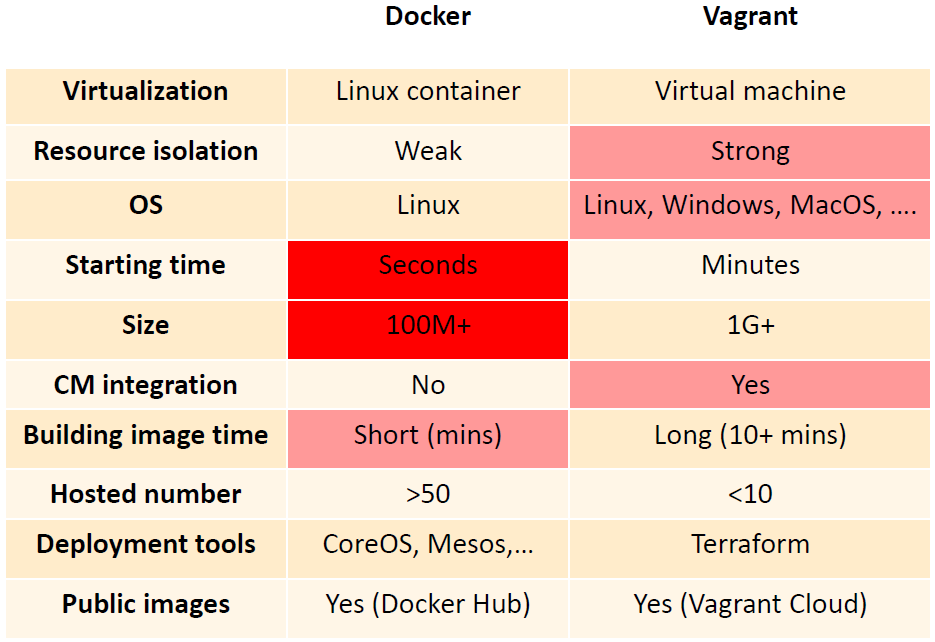
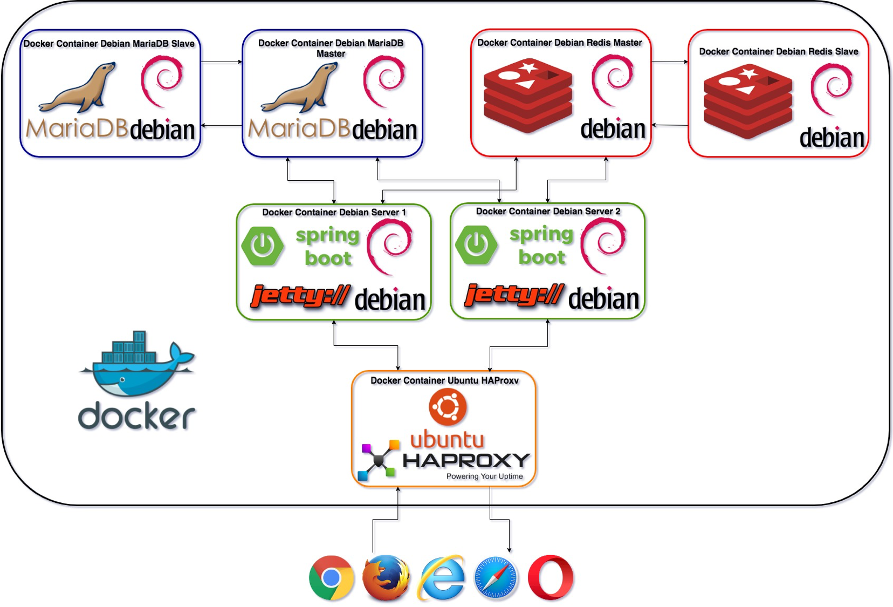

<!-- $theme: gaia -->
<!-- page_number: true -->

# Axway With Docker
##### Created By Rizki Mufrizal

---
# Rizki Mufrizal
* API Consultant at Emerio Indonesia
* Kotlin, Container and Microservice Enthusiast
* mufrizalrizki@gmail.com
* Rizki.Mufrizal@emeriocorp.com
* https://rizkimufrizal.github.io

---
# Agenda

* Intro Docker
* Exercise Docker
* Intro Docker Compose
* Exercise Docker Compose
* Intro Axway With Docker
* Exercise Axway With Docker

---
# Apa Itu Docker ?

>Docker adalah sebuah project open source yang ditujukan untuk developer atau sysadmin untuk membangun, mengemas dan menjalankan aplikasi dimana pun di dalam sebuah container.

---
# Docker VS Vagrant (VM)

# 

---
# Arsitektur Docker

# 

---
# Komponen Docker

* Docker Daemon
* Docker Images
* Docker Container
* Docker Registry

---
# Exercise Docker

### Yang Perlu Dipersiapkan
* VirtualBox
* Vagrant

### Task
* Instalasi Docker
* Menjalankan Apache Cassandra di Docker

---
# Apa Itu Docker Compose

>Docker compose berfungsi untuk menjalankan container docker secara bersamaan.

---
# App With Docker Compose

# 

---
# Exercise Docker Compose

### Yang Perlu Dipersiapkan
* VirtualBox
* Vagrant

### Task
* Instalasi Docker Compose
* Menjalankan Cluster Apache Cassandra dengan Docker Compose

---
# Axway With Docker

Axway API Gateway 7.5.3 support dijalankan diatas Docker. Axway telah mempersiapkan template docker berdasarkan kebutuhan topology yang diinginkan.

---
# Kelebihan Template Docker Axway

* Support API Gateway HA
* Apache Cassandra HA
* Pembatasan memory Apache Cassandra
* Auto Configure Admin Nodemanager dan instance

---
# Kekurangan Template Docker Axway

* Tidak dapat menggunakan lebih dari 2 server jika menggunakan HA
* Belum mendukung DC/DR Apache Cassandra

---
# Improve Template Docker Axway

* Dapat menggunakan lebih dari 1 server untuk HA
* DC/DR Cassandra tapi menggunakan tambahan cluster pada docker seperti docker swarm dan kubernetes

# Apa Yang Dirubah

* Script Jython Axway
* Format Topology

---
# Exercise Axway With Docker

#### Yang Perlu Dipersiapkan
* VirtualBox
* Vagrant

#### Task
* Download Template Docker yang sudah dicustom
* Menjalankan axway di docker dengan requirment :
  - 1 Admin Nodemanager
  - 1 Instance API Manager (MGMT)

---
# Any Question ?
---
# Thanks