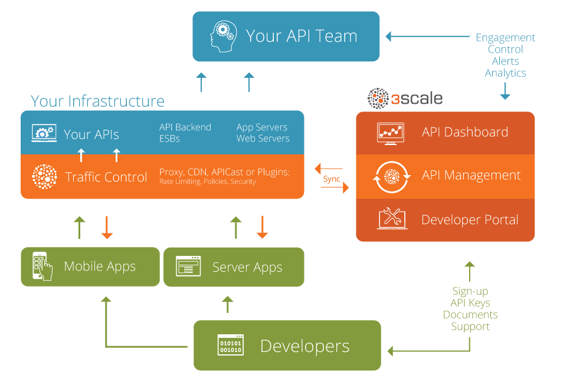

<!-- $theme: gaia -->

<!-- page_number: true -->

# API Gateway 3Scale
##### Created By Rizki Mufrizal

---
# Rizki Mufrizal
* API Consultant at Emerio Indonesia
* Kotlin, Container and Microservice Enthusiast
* mufrizalrizki@gmail.com
* Rizki.Mufrizal@emeriocorp.com
* https://rizkimufrizal.github.io

---
# Agenda

* Intro Openshift
* Intro 3Scale
* Intro 3Scale Management
* Intro 3Scale Gateway
* Exercise 3Scale Gateway

---
# Apa Itu Openshift ?

>OpenShift is Red Hat’s Platform-as-a-Service (PaaS) that allows developers to quickly develop, host, and scale applications in a cloud environment.

---
# Apa Itu 3Scale ?

>3Scale adalah salah satu API Gateway yang dikembangkan oleh RedHat, dimana 3Scale akan dijalankan diatas openshift

---
# Komponent 3Scale

* API Management
* Gateway (apicast)
* API Portal

---
# Arsitektur 3Scale

# 

---
# Exercise

### Yang Perlu Dipersiapkan
* VirtualBox
* Vagrant

### Task
* Menjalankan openshift diatas vagrant
* Deploy 3Scale gateway(apicast) di openshift
---
# Any Question ?
---
# Thanks