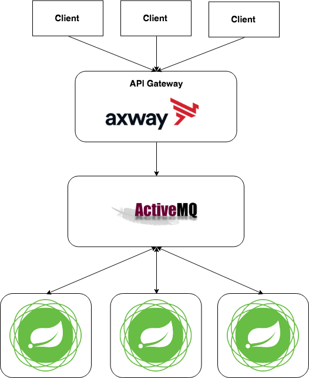

<!-- $theme: gaia -->
<!-- page_number: true -->

# JMS And API Portal Axway
##### Created By Rizki Mufrizal

---
# Rizki Mufrizal
* API Consultant at Emerio Indonesia
* Kotlin, Container and Microservice Enthusiast
* mufrizalrizki@gmail.com
* Rizki.Mufrizal@emeriocorp.com
* https://rizkimufrizal.github.io

---
# Agenda

* Intro API Portal With Multiple API Manager
* Intro JMS And ActiveMQ
* Exercise JMS With Java
* Intro Axway API Gateway With JMS
* Exercise Axway API Gateway With JMS

---
# API Portal With Multiple API Manager
>Multiple API Manager dengan 1 API Portal berfungsi untuk membuat sebuah portal dengan 2 fungsi, dimana disatu sisi portal berfungsi sebagai sandbox dan disisi lain berfungsi untuk melihat analytics dari production.

---
# Arsitektur API Portal

# 

---
# Apa Itu JMS ?

>JMS adalah interface berbasis java untuk pelayanan messaging. Aplikasi yang menjembatani pengiriman pesan antara aplikasi dinamanya MoM (Message Oriented Middleware). JMS adalah salah satu implementasi dari MoM.

Contoh JMS :
* ActiveMQ
* IBM MQ

---
# Exercise JMS With Java

### Yang Perlu Dipersiapkan
* Netbeans
* ActiveMQ

### Task
* Membuat server worker untuk memproses request yang terdapat di dalam ActiveMQ

---
# Axway API Gateway With JMS

>Axway API Gateway mendukung JMS, biasanya digunakan untuk proses pengiriman request dari client ke JMS.

JMS yang terdapat pada Axway API Gateway :

* Embedded Apache ActiveMQ
* ActiveMQ
* IBM MQ
* Standard JMS (Oracle WebLogic Server, etc)

---
# Architecture JMS In Axway

# 

---
# Exercise Axway API Gateway With JMS

### Yang Perlu Dipersiapkan
* Netbeans
* ActiveMQ

### Task
* Membuat Request Response JMS melalui Policy

---
# Any Question ?
---
# Thanks